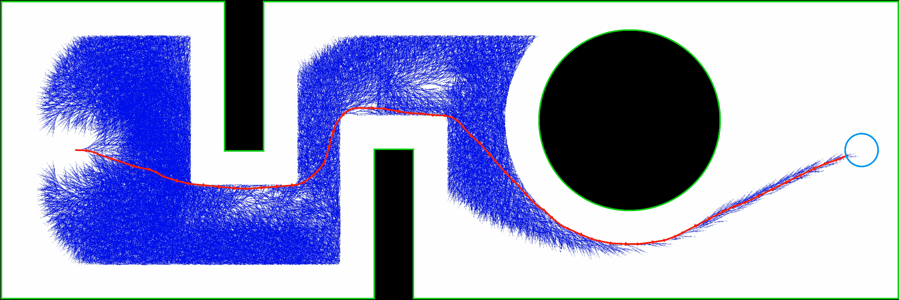

# Non-Holonomic-A-Star-Planner
An implementation of the A* Algorithm to plan optimal paths between a known starting and goal position in an obstacle-ridden 6000*2000 grid world.

Link to the GitHub Repository can be found [here](https://github.com/vikrams169/Non-Holonomic-A-Star-Planner).

## Authors
<b>Vikram Setty</b>
<ul>
<li> UID: 119696897
<li> Directory ID: vikrams
</ul>
<b>Vinay Lanka</b>
<ul>
<li> UID: 12041665
<li> Directory ID: vlanka
</ul>

## Part 1

### Overview
On giving start and goal location coordinates, the path planner computes the shortest path using the A* Algorithm while avoiding obstacles (with a clearance of a used-specified input) in grid-world.

On finding the final path, the planner makes a video with intermediate frames and displays it as a pop-up animation.

A video simulating the planner computing the optimal trajectory can be found as `a_star.mp4`. Further, the final path visualization in the map looks as shown below. The black represents obstacles, gray represents obstacle and wall clearance, and the white areas are open space. The blue filled gridcells have already been explored by the planner and the final optimal path is shown in green.

<p align="center">
  
</p>

This project majorly uses OpenCV for generating the visualiziation and OpenCV and ImageIO for displaying the animation.

### Dependencies
The dependencies for this Python 3 project include the following:
<ul>
<li> NumPy
<li> OpenCV
</ul>
They can be installed using the following commands.

```sh
    pip3 install numpy
    pip3 install opencv-python
```

### Running the Code
To run the code, execute the following command
```sh
    python3 a_star.py
```
On doing so, the terminal should prompt for the coordinate positions of start and goal locations which the user has to enter. Note a couple points:
<ul>
<li> Enter integer values
<li> Use the coordinate system considering the bottom-left of the window/map as the origin
<li> If any of the coordinate locations you have enetered is not valid i.e. out of map bounds, or within an obstacle/its clearance considering the radius of the robot (user-specified), you will be prompted to enter all the coordinate locations again till they are valid. Note that even the walls/boundaries of the grid world have a clearance based on a user-specified input.
</ul>

A sample set of start and goal positions (in the format [x,y,theta] and [x,y] respectively with the orientation angle theta in degrees) to enter (that goes from one corner of the grid to the other) include the one below. This particular case can execute in about 10 seconds depending upon system specifications.
<ul>
<li> Clearance: 10
<li> RPM1: 50
<li> RPM2: 100 
<li> Start Position: (500,1000,0)
<li> Goal Position: (5750,1000)
</ul>

After the program accepts your start and goal locations, it will start computing the path. Ater computing the final path, it will generate and display a video `a_star.mp4`from the saved frames and delete all the individual frames themselves. The total time taken to run the A* Algorithm will be displayed to the terminal as well.

### Simulation Video

The YouTube link to a sample simulation video of this project is embedded below. The link to the same can also be found [here](https://www.youtube.com/watch?v=Eoj4YyOxvfU).

[](https://www.youtube.com/watch?v=6D_xVzv4fGo)


## Part 2

### Overview

The second part of the project replicates the A* algorithm devised in Part 1 in a Gazebo simulation environment using ROS 2. By saving the RPM inputs to each wheel at each timestep of the optimal path, an appropriate conversion to the linear and angular velocity input to the non-holonoimic differential-drive Turtlebot 3 Waffle-Pi robot is given to enable the robot to follow the same trajectory in the same map in Gazebo (scaled by 1mm/pixel).

### Dependencies

This package is tested to run in a ROS 2 Galactic setup on Ubuntu 20.04. Please prefer this environment specification before proceeding. In addition, a couple more dependencies needed to run the package can be installed using the commands below.

```sh
    
```

### Executing the Package

To run a sample trajectory, execute the following commands.
```sh
    # Navigate to the src directory of your ROS 2 workspace
    cd ros2_ws/src/
    # Clone/download the package to this destination
    git clone https://github.com/vikrams169/Non-Holonomic-A-Star-Planner/tree/main/Part2/turtlebot3_project3
    # Navigate back to the ROS 2 workspace
    cd ..
    # Build the package and source the setup file
    colcon build && source install/setup.bash
    # Run the launch file to start the sample trajectory
    roslaunch turtlebot3_project3 ...
```

### Simulation Video

The YouTube link to a sample simulation video of this project is embedded below. The link to the same can also be found [here](https://www.youtube.com/watch?v=Eoj4YyOxvfU).

[](https://www.youtube.com/watch?v=6D_xVzv4fGo)


